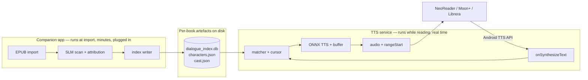
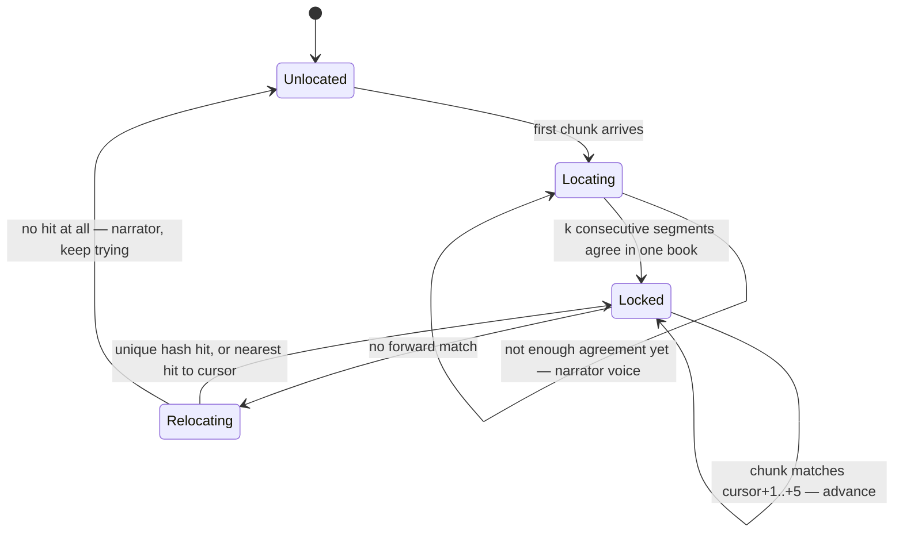

# Quire — Architecture

How PRD v1.2 fits together. This document is kept in sync with the code: any ticket that
changes structure updates it in the same PR (CLAUDE.md §5).

> Status: design. Rewritten 2026-08-27 for PRD v1.2 (system TTS engine). The v1.1
> standalone-reader architecture is in git history if V3.0 ever needs it.

---

## 1. Two processes, and why that matters

v1.2's defining structural fact is that Quire is **two programs that never run at the
same time**, sharing one on-disk contract.



Three consequences follow immediately, and they are most of why this design is better
than v1.1:

1. **The memory problem largely dissolves.** The 1B SLM lives only in the companion app;
   the TTS service holds ONNX plus SQLite. They are never co-resident, by construction
   rather than by scheduling discipline. `docs/adr/0003-memory-arbitration.md` is now a
   much smaller decision than it was.
2. **The indexing budget relaxes.** Attribution is no longer anywhere near a real-time
   path, so the target is ~30 minutes for a 100k-word novel in the foreground with
   progress shown, not 10 minutes (decided 2026-08-27). The throughput work in §5 is
   still needed to hit even that.
3. **Quire owns no UI on the reading surface.** The host app renders, paginates, tracks
   position and owns the transport. Quire supplies audio and, where the host uses it,
   `rangeStart` callbacks for highlighting.

### Module graph

```
app:companion   import, indexing, progress UI, (V2) voice drawer   → holds the SLM
app:ttsservice  TextToSpeechService, matcher, synthesis            → holds ONNX TTS
core:epub       EPUB → ordered Segment stream
core:attribution  Tier 1 heuristics, Tier 2/3 SLM, book scan       (companion only)
core:index      dialogue_index.db — schema, writer, reader, matcher, cursor
core:tts        ONNX engine, voice casting, ring buffer            (service only)
core:model      shared types, no behaviour
```

`core:index` is the seam between the two processes and therefore **the interface to
freeze first** — it is to v1.2 what `characters.json` was to v1.1. Everything else
parallelises behind it.

---

## 2. The unit of work is the segment, not the paragraph

Carried forward from v1.1 and reinforced by measurement (QUI-018): a paragraph regularly
contains narration and two speakers, so the unit that gets *a voice* must be finer than
the unit a reader hands us.

```
Segment { seq, text, normalized, kind: narration|dialogue, speakerId?, confidence }
```

The index is a **densely ordered sequence of segments per book**. `seq` is the spine of
v1.2 the way the Readium locator was the spine of v1.1 — with the crucial difference that
Quire assigns it, so it survives the fact that we can no longer see the host's position.

---

## 3. Matching: a cursor, with hashes for recovery

`onSynthesizeText(request, callback)` hands over a bare string. No book, no chapter, no
position. Everything below exists to reconstruct what the API throws away.

**Why not a plain hash table.** Text → speaker is many-to-many. `"Well,"` appears twice
with two different speakers in a fixture of twenty lines; real novels are dense with bare
`"Yes."`, `"I know."`, `"No."`. A hash lookup answers confidently and wrongly on exactly
the rapid back-and-forth dialogue the product exists to voice. So the hash index is the
*recovery* mechanism, not the primary one.

**Reading is sequential.** That is the exploitable fact. Once located, the next chunk is
almost always the next segment.



- **Normalisation** before any comparison: NFKC, lowercase, strip quote marks and
  footnote markers, collapse whitespace, drop soft hyphens. Both sides of the comparison
  run the identical function — it lives in `core:index` precisely so the writer and the
  matcher can never drift apart.
- **A window, not an increment.** The matcher tries `cursor+1 … cursor+5`, because hosts
  skip chapter headings, page numbers and footnotes unpredictably.
- **A chunk may span several segments.** Hosts send anything from a sentence to a page.
  When one incoming chunk covers *N* consecutive index entries, Quire synthesises each in
  its own voice, in order, inside the single `onSynthesizeText` call. This is the whole
  mechanic that makes multi-voice work through a single-voice API.
- **Confidence gates apply to the stored value** at lookup: ≥0.65 the character voice,
  0.40–0.64 the most active speaker near the cursor, <0.40 the narrator.
- **Never block on a miss.** An unmatched chunk is read by the narrator immediately.
  Silence is a bug; a wrong voice is a bug; a narrator voice is a graceful degradation.

### Book identification

Locking on is fingerprinting: hash the first few normalised chunks, look for a book whose
index contains them in sequence, require *k* consecutive agreements before locking. Until
locked, everything is narrator — correct-sounding, just not yet cast. A companion-app
override exists for when detection fails or two editions collide.

---

## 4. Synthesis under a host we do not control

The host owns the transport, and that changes the buffer's job.

- **Pre-synthesis is possible precisely because we hold the cursor.** Knowing we are at
  `seq`, the service synthesises `seq+1 … seq+3` while the current utterance plays, keyed
  by `seq`. The PRD's rolling buffer survives the pivot intact — arguably it only works
  *because* of the index.
- **The first utterance is always cold.** TTFS < 800 ms is therefore a single-segment
  synthesis budget, not a buffering one.
- **Rate and pitch come from the host** in the `SynthesisRequest` and must be honoured;
  Quire's character voices are pitch/timbre offsets applied *on top of* the host's
  setting, never instead of it.
- **`onStop` must be prompt**, and in-flight synthesis cancelled — the host calls it on
  every page turn in some readers.
- **One model instance, serialised inference.** Concurrency here buys nothing at RTF 0.15
  and doubles peak memory.

### Highlighting

Not lost, as first thought. `callback.rangeStart(start, end, frame)` lets the engine tell
the host which range is being spoken, and Tier 1 hosts use it to highlight. Quire emits
ranges from the TTS boundary timestamps. Accuracy depends on the host; PRD V3.0's
built-in reader exists to make it guaranteed rather than best-effort.

---

## 5. Throughput is still the hard constraint

Unchanged from the v1.1 analysis, and now *more* binding because the whole book must be
indexed up front — the host can jump anywhere and gives us no signal to prepare a chapter.

The 750G has no i8mm, so a 1B Q4 model generates slowly. Attributing ~3,000 dialogue lines
with a fresh ~300-token window each lands in the hours. Therefore:

- Attribution runs **chapter-at-a-time with KV-cache reuse**, not line-at-a-time.
- Generation is **constrained to a single token** — an index into the candidate speakers.
- **Tier 1 coverage is a performance feature.** Measured at 44.4% coverage / 100%
  precision on hand-written fixtures (QUI-018); every point of coverage is work the SLM
  never does.

See [`device-profile.md`](device-profile.md) §2.

---

## 6. Data at rest

```
books/<bookId>/
  characters.json      the cast and their traits (QUI-005 schema)
  cast.json            character → voice, plus user overrides
  dialogue_index.db    SQLite: ordered segments, normalised text, hash, speaker, confidence
cache/audio/           ephemeral PCM keyed by seq, cleared on startup and after playback
```

`dialogue_index.db` is written once by the companion app and opened **read-only** by the
TTS service. One writer, one reader, no locking problem. The book's own text is not
copied into the service's world beyond the index.

Everything is local. Book content and generated audio never leave the device (CLAUDE.md §8).

---

## 7. Concurrency

| Context | What runs there | Priority |
| --- | --- | --- |
| Binder thread (`onSynthesizeText`) | matching, cursor update, writing PCM to the callback | must not block |
| Synthesis worker (service) | one ONNX session, serialised | high, cancellable |
| Indexing worker (companion) | EPUB parse, SLM scan, index write | low, resumable |
| Companion UI | import progress | — |

---

## 8. Road to a first prototype

Risk-first. The ordering changed with the pivot: the binding risk is no longer "can these
models hit their numbers" but **"does the interception work at all on the target reader"**
— and that is a day of work to find out, not a week.

| Milestone | Goal | Tickets | Done when |
| --- | --- | --- | --- |
| **M0a — Prove interception** | Does NeoReader actually route Read Aloud to a third-party engine, and can we return audio? | QUI-020 | A hello-world engine speaks a book in NeoReader on the Note Air5 C |
| **M0b — Prove the stack** | Do the models hit their numbers? | QUI-017, QUI-018 | ADRs 0001–0003 from measurements |
| **M1 — Vertical slice** | Read Aloud in NeoReader, in three voices | QUI-019 (+ 021, 022, 024) | A chapter plays with narrator and two characters |
| **M2 — MVP** | Any book, any Tier 1 reader | the rest | Import, read aloud, no setup |

Prior art worth reading before QUI-020: `mateogon/boox-supertonic-tts` is an unofficial
third-party TTS engine for NeoReader using sherpa-onnx. It confirms the premise, confirms
`rangeStart` reaches NeoReader's highlighting, and documents the engine-rebinding quirk.

---

## 9. Open questions

1. **Chunk granularity per host.** Everything in §3 assumes hosts send roughly
   sentence-to-paragraph chunks. If NeoReader sends whole pages, or splits mid-sentence at
   the 4000-character API limit, the matcher needs prefix matching rather than whole-chunk
   matching. Settled by observation in QUI-020.
2. **Editions.** Two EPUBs of the same novel differ in whitespace, hyphenation and
   footnotes. How far normalisation carries across editions is unmeasured; worst case the
   user must index the exact file they read.
3. **Voice pool size.** Casting distinctness depends on how many usable variants the
   chosen engine ships. Unknown until ADR-0002.
4. **Scene boundaries** for the 0.40–0.64 "most active speaker" band. Chapter breaks are a
   crude proxy. Deferred until QUI-009 has fixture data.
5. **RTF and battery SLAs** are retained in PRD §4 but not restated by v1.2 — confirm.
