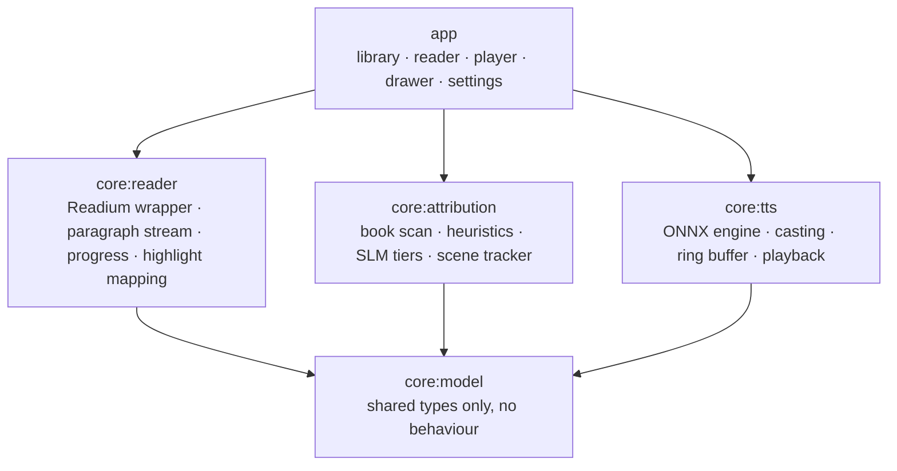

# Quire — Architecture

How the pipeline in [PRD §3](PRD.md#3-system-architecture--ai-pipeline) actually fits
together. This document is kept in sync with the code: any ticket that changes structure
updates it in the same PR (CLAUDE.md §5).

> Status: design, no code yet. Sections marked **OPEN** are decisions we have chosen not
> to make until we have measurements from QUI-017.

---

## 1. Module graph



Rules, enforced by QUI-001:

- Dependencies point downward only. No `core → core` edges except onto `core:model`.
- `core:model` holds types and nothing else: no I/O, no Android framework, no Readium.
- **Keep `core:model` and `core:attribution` free of Android framework dependencies.**
  iOS is out of scope, so this is no longer about multiplatform — it is about testing.
  Pure-Kotlin cores run the attribution fixtures on a desktop JVM in seconds instead of
  on a device in minutes, which is the loop QUI-018 depends on.

The three cores never call each other. Everything is composed in `app`, which owns the
wiring and the lifecycle. That is what lets three agents work on three cores at once.

---

## 2. The spine: locators and paragraph units

One idea holds the whole system together: **every subsystem addresses text by the same
Readium locator, and the unit of work everywhere is the paragraph.**

```
ParagraphUnit { locator, text, chapterIndex, index }
```

- The reader produces the ordered stream of `ParagraphUnit`s (QUI-002).
- Attribution consumes it and produces `AttributionResult` keyed by the *same* locator.
- The ring buffer synthesises per paragraph.
- Highlighting maps a playhead position back through boundary timestamps to a sentence
  range inside a paragraph, and hands the reader a locator.

Because the key is shared and stable, every stage can be built, tested, cached and
re-run independently. Nothing downstream ever parses text again.

Sentences are a sub-unit, derived once inside a paragraph, used only by synthesis and
highlighting. Paragraphs are the scheduling atom; sentences are the display atom.

---

## 3. Two pipelines, two time budgets

The single most important structural fact about Quire is that it has **two** pipelines
with wildly different budgets, and they must not touch.

### 3.1 Import-time pipeline — batch, slow, resumable, interruptible

```
EPUB ──► Readium parse ──► paragraph stream ──► book scan (SLM) ──► characters.json
                                             └─► Tier 1 heuristics ──► attribution cache
                                                                    └─► voice casting ──► cast.json
```

Runs in a background worker on import. Minutes are acceptable. Must be resumable, must
survive process death, must not block reading. Output is three small JSON artefacts on
disk that make playback cheap forever after.

### 3.2 Playback-time pipeline — real time, budgeted, never blocked

```
playhead ──► attribution cache lookup ──► cast lookup ──► TTS synthesis ──► ring buffer ──► audio out
                                                              │
                                                              └─► boundary timestamps ──► highlight
```

Budgets: TTFS < 800 ms, RTF ≤ 0.15. **Nothing in this path may miss.** A cache lookup
that comes back empty falls through to the Narrator voice rather than waiting for a
model — attribution is an optimisation at playback time, never a dependency.

That "never a dependency" rule is what buys us §4.

---

## 4. The binding constraint: memory — **OPEN**

A Q4-quantized 1B SLM resident is roughly 700 MB–1 GB. Kokoro-TTS at 82M is a few
hundred MB with its ONNX runtime. The reader UI with a paginated publication is not free.
The PRD's ceiling is 1.2 GB for all of it (PRD §5).

**Revised 2026-08-27, once the reference device was fixed.** The Note Air5 C has 6 GB of
RAM ([`device-profile.md`](device-profile.md)), so co-residency is likely to *fit*. The
1.2 GB ceiling is now a self-imposed budget for surviving in the background rather than a
hardware wall, and the argument here is weaker than it was when written.

Two things keep the separation anyway. First, a design that only works with 6 GB narrows
the product to premium hardware. Second — and this one is not about memory at all — the
battery budget is ≈1.14 W for the whole device during playback, which rules out keeping a
language model warm while audio plays however much RAM is free.

So the architecture forces them apart in time:

| | SLM resident | TTS resident |
| --- | --- | --- |
| Import / scan | yes | no |
| Reading, no audio | on demand, evictable | no |
| Playback | **never** | yes |

The consequence is that **all attribution is precomputed and cached before playback
reaches it**, at one of three granularities:

- **(a) Whole book at import.** Longest wait, simplest runtime, safest memory. 
- **(b) Chapter-ahead.** Attribute chapter *n+1* while the reader is in chapter *n*, with
  the SLM loaded and then released before audio starts. Amortised, but pays model
  load/unload churn.
- **(c) Co-resident with tighter quantization.** Fastest to build, most likely to blow
  the RAM budget on the devices that matter.

**Recommendation: (b), with (a) offered as a "prepare whole book" option.** But this is
the one decision we should buy with measurements rather than argument — QUI-017 measures
resident set *and* power draw for both models and settles it as
`docs/adr/0003-memory-arbitration.md`.

### 4.1 Throughput is the harder half of the problem

The 750G has ARMv8.2 dot-product but no i8mm, so quantized matmul takes the slower path
and a 1B Q4 model generates at single-digit to low double-digit tokens/s. Attributing
~3,000 dialogue lines with a fresh ~300-token context window each re-processes close to a
million tokens and lands in the **hours**, against QUI-007's 10-minute budget.

That is a structural constraint on the attribution design, not a tuning problem:

- Attribution runs **chapter-at-a-time with KV-cache reuse**, not line-at-a-time. The
  chapter is fed once as a rolling context and speakers are queried as it advances.
- Generation is **constrained to a single token** — an index into the candidate speaker
  list — so a line costs one token, not twenty.
- **Tier 1 coverage is a performance feature.** Every line the heuristics resolve is a
  line the model never sees, which is why QUI-018 reports Tier 1 coverage as a headline
  number rather than a curiosity.

See [`device-profile.md`](device-profile.md) §2.

Note this differs from a literal reading of PRD §3.1, which implies the SLM is consulted
as reading proceeds. The observable behaviour is identical; only the timing moves. If
measurement shows co-residency is actually fine, we revert to the literal design.

---

## 5. Data at rest

```
books/<bookId>/
  book.epub            imported copy, never mutated
  characters.json      QUI-005 schema — the cast and their traits
  attribution.jsonl    one AttributionResult per line, append-only, locator-keyed
  cast.json            character → voice, plus user overrides
  progress.json        last position + recovery history
cache/audio/           ephemeral .wav chunks, cleared on startup and after playback
```

Everything is per book and local. `attribution.jsonl` is append-only so a scan
interrupted at 60% resumes rather than restarts, and so a later re-run at a better tier
can supersede an earlier line without a rewrite. Nothing here leaves the device, ever
(CLAUDE.md §8).

---

## 6. Concurrency

Four contexts, and they are strictly separated:

| Context | What runs there | Priority |
| --- | --- | --- |
| Main / UI | rendering, input, highlight invalidation | — |
| Audio | playback from the ring buffer | real-time |
| Synthesis worker | one ONNX session, serialised | high, cancellable |
| Background worker | import scan, attribution lookahead | low, resumable, evictable |

The synthesis worker is single-threaded on purpose: a second concurrent ONNX session
doubles peak memory for no throughput gain when we are already at RTF 0.15.

Every long-running operation takes a cancel signal. Seeking cancels in-flight synthesis;
closing a book cancels attribution; memory pressure evicts the SLM.

---

## 7. Keeping audio and text in step

Both directions run through one owned value — the playhead locator:

- Audio → text: `TtsChunk.boundaries` gives `startMs → charRange`; the buffer knows which
  paragraph a chunk came from; the reader turns that into a sentence highlight (QUI-014).
- Text → audio: tapping a sentence, or turning a page while playing, sets the playhead;
  the buffer re-seeds from there (QUI-012).
- Pausing writes the playhead into `progress.json`, which is the same store the reader
  restores from (QUI-004). There is no second notion of "where I am".

---

## 8. Road to a first prototype

Three milestones. The ordering is deliberately risk-first, not feature-first: the reader
shell is well-understood work and can wait, while the model performance on real e-ink
hardware is the thing that can invalidate the entire product.

| Milestone | Goal | Tickets | Done when |
| --- | --- | --- | --- |
| **M0 — Prove the stack** | Do these models hit the SLAs on real hardware? | QUI-017, QUI-018 | ADRs 0001–0003 written from measurements; a headless EPUB → wav run exists |
| **M1 — Vertical slice** | One chapter, audible, in three voices, highlighted | QUI-019 (+ 002, 005, 010, 012) | You can hear a chapter on a Boox and watch the line track |
| **M2 — Prototype** | Any book, end to end, no setup | 001, 003, 004, 006–016 | Import any EPUB, press Play, it just works |

M0 is days of work and can kill or confirm the stack before we build anything on top of
it. Do not start M1 before ADR-0002 names a TTS engine.

---

## 9. Open questions

1. **Memory arbitration** — §4. Settled by QUI-017 → ADR-0003.
2. ~~**iOS in v1?**~~ **Closed 2026-08-27: Android only.** Out of scope, not deferred.
   PRD §2 updated.
3. **Scene boundaries.** Tier 3 fallback needs a notion of "the current scene". Chapter
   breaks are a crude proxy; section breaks and time-skips are not detectable by regex.
   Deferred until QUI-009 has fixture data showing whether it matters.
4. **Voice pool size.** Casting distinctness (QUI-011) depends on how many usable voice
   variants the chosen engine ships. Unknown until ADR-0002.
